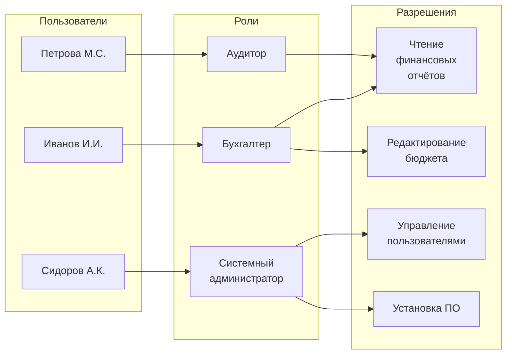
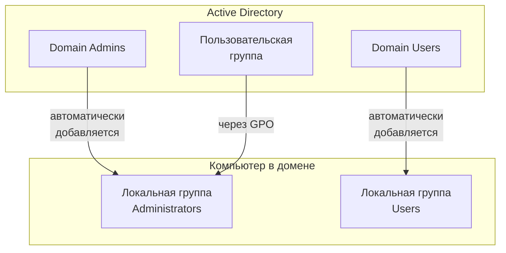
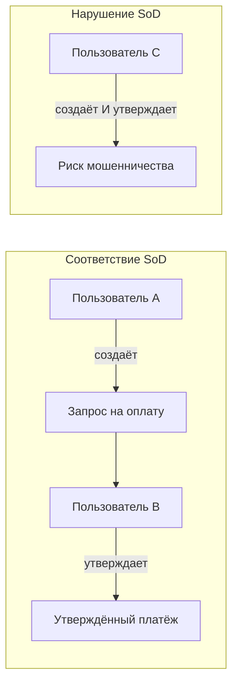
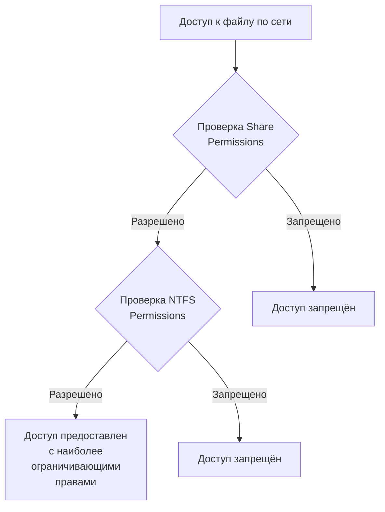

# Роли и уровни прав доступа в операционных и сетевых системах

## 1. Роли как абстракция управления доступом

**Роль** в контексте операционных и сетевых систем — это именованный набор прав и привилегий, который может быть назначен одному или нескольким пользователям. Роль описывает не конкретного человека, а функцию или должность в организации.

Фундаментальное различие между ролью и учётной записью заключается в уровне абстракции. Учётная запись привязана к конкретному индивидуальному пользователю (например, `ivan.petrov`), в то время как роль описывает категорию пользователей с одинаковыми потребностями в доступе (например, «бухгалтер», «системный администратор», «аудитор»).

Абстракция ролей решает несколько критических проблем управления доступом:

**Упрощение администрирования.** Вместо назначения прав каждому пользователю индивидуально администратор определяет роли один раз, после чего просто назначает пользователей в соответствующие роли. Если в компании работает 50 бухгалтеров, не нужно вручную настраивать права для каждого — достаточно создать роль «Бухгалтер» и добавить всех сотрудников в неё.

**Соответствие организационной структуре.** Роли естественным образом отражают структуру организации и должностные обязанности. Когда сотрудник меняет должность, администратору достаточно изменить назначение ролей, а не редактировать сотни индивидуальных разрешений.

**Снижение ошибок.** Централизованное управление правами через роли уменьшает вероятность случайно предоставить излишние права или забыть отозвать доступ у уволившегося сотрудника.



Важно отметить, что один пользователь может одновременно принадлежать к нескольким ролям. Например, сотрудник может быть одновременно «менеджером проекта» и «разработчиком», получая суммарные привилегии обеих ролей.

---

## 2. Иерархия уровней привилегий

Операционные системы традиционно реализуют многоуровневую модель привилегий, в которой пользователи и процессы работают с различной степенью доступа к ресурсам системы.

#### Аппаратные уровни привилегий

На аппаратном уровне современные процессоры поддерживают несколько **колец защиты** (protection rings). Процессоры архитектуры x86 предоставляют четыре кольца (0–3), где кольцо 0 обладает максимальными привилегиями, а кольцо 3 — минимальными. Однако большинство современных операционных систем, включая Linux и Windows, используют только два уровня:

- **Кольцо 0 (Kernel Mode, Supervisor Mode)** — режим ядра, в котором выполняются критические компоненты операционной системы. Код, работающий в этом режиме, имеет неограниченный доступ ко всем системным ресурсам, включая память, процессор, порты ввода-вывода и привилегированные инструкции.

- **Кольцо 3 (User Mode)** — пользовательский режим, в котором выполняются обычные приложения. Процессы в этом режиме ограничены в доступе к аппаратным ресурсам и не могут напрямую взаимодействовать с оборудованием или критическими областями памяти.

Когда пользовательский процесс пытается выполнить привилегированную операцию (например, обратиться к порту ввода-вывода), процессор генерирует исключение, передавая управление ядру операционной системы. Ядро проверяет права процесса и либо выполняет запрошенную операцию от его имени, либо отклоняет запрос.

#### Логические уровни в операционных системах

Поверх аппаратных уровней операционные системы реализуют логическую иерархию пользовательских привилегий:

**Обычный пользователь (Standard User, Regular User)** — базовый уровень привилегий, достаточный для повседневной работы. Пользователь может запускать приложения, создавать и редактировать собственные файлы, изменять личные настройки, но не может вносить изменения, затрагивающие всю систему или других пользователей.

**Привилегированный пользователь (Power User)** — промежуточный уровень, существующий в некоторых системах (например, в Windows). Такие пользователи имеют расширенные права по сравнению с обычными, но ограничены по сравнению с администраторами. Например, могут устанавливать определённое ПО, но не изменять критические системные настройки.

**Администратор (Administrator, Root)** — максимальный уровень привилегий, позволяющий полный контроль над системой. Администраторы могут устанавливать и удалять программное обеспечение, изменять системные настройки, управлять учётными записями пользователей, настраивать безопасность и выполнять любые операции без ограничений.

**Гостевой доступ (Guest)** — минимальный уровень привилегий, часто используемый для временных пользователей. Гости обычно не могут устанавливать ПО, изменять настройки или сохранять данные на постоянной основе. Изменения, внесённые гостем, часто отменяются после завершения сеанса.

Такая многоуровневая структура позволяет гибко разграничивать доступ в зависимости от потребностей пользователей и требований безопасности. Принцип заключается в том, чтобы каждый пользователь и процесс работали с минимально необходимыми привилегиями для выполнения своих задач.

---

## 3. Модель прав доступа в Unix/Linux

Unix и Linux реализуют классическую модель прав доступа, основанную на триаде **владелец — группа — остальные** (owner — group — others). Эта модель применяется к каждому файлу и директории в системе.

#### Владельцы и группы

Каждый файл в Unix-системе имеет два атрибута владения:

- **Владелец (Owner)** — пользователь, создавший файл или получивший права владения через команду `chown`. Только владелец (или суперпользователь root) может изменять права доступа к файлу и передавать владение другому пользователю.

- **Группа (Group)** — группа пользователей, ассоциированная с файлом. При создании файла ему автоматически назначается основная группа пользователя-создателя. Владелец может изменить группу файла на любую, к которой он принадлежит, используя команду `chgrp`.

Третья категория — **остальные (Others)** — включает всех пользователей системы, не являющихся владельцем и не входящих в группу файла.

#### Типы разрешений

Для каждой из трёх категорий (владелец, группа, остальные) определяются три базовых типа разрешений:

- **r (read)** — чтение. Для файла позволяет просматривать его содержимое. Для директории — получать список файлов внутри неё.

- **w (write)** — запись. Для файла позволяет изменять его содержимое. Для директории — создавать и удалять файлы внутри неё.

- **x (execute)** — выполнение. Для файла позволяет запускать его как программу или скрипт. Для директории — входить в неё и обращаться к файлам внутри (при наличии соответствующих прав на сами файлы).

Права отображаются в виде строки из 10 символов, где первый символ указывает тип объекта (`-` для файла, `d` для директории), а оставшиеся 9 разделены на три группы по три символа:

```
-rwxr-xr--
```

В этом примере:
- Владелец имеет права `rwx` (чтение, запись, выполнение)
- Группа имеет права `r-x` (чтение и выполнение, но не запись)
- Остальные имеют права `r--` (только чтение)

#### Принцип проверки прав

Когда пользователь пытается получить доступ к файлу, система проверяет права в строго определённом порядке:

1. Если пользователь является владельцем файла, применяются права владельца. Дальнейшие проверки не производятся.
2. Если пользователь не является владельцем, но входит в группу файла, применяются групповые права.
3. Если пользователь не владелец и не в группе, применяются права для остальных.

Эта модель обладает важным свойством: категории взаимно исключают друг друга. Пользователь не может одновременно подпадать под несколько категорий. Если вы владелец файла, групповые права и права остальных на вас не распространяются, даже если они более разрешающие.

#### Зачем триада?

Модель «владелец — группа — остальные» обеспечивает гибкое и эффективное управление доступом в многопользовательской среде:

- **Владелец** контролирует собственные файлы
- **Группа** позволяет организовать совместную работу над проектами без предоставления доступа всем пользователям системы
- **Остальные** определяют, что могут видеть или делать все остальные пользователи

Эта структура элегантна в своей простоте и охватывает большинство практических сценариев использования, оставаясь при этом понятной для администраторов.

---

## 4. Роли и группы в Windows

Windows использует более сложную модель управления доступом по сравнению с Unix, включающую локальные и доменные группы, встроенные роли и гибкие списки управления доступом (ACL).

#### Локальные группы

В автономной системе Windows или на рабочих станциях, не входящих в домен Active Directory, используются **локальные группы**. Встроенные локальные группы включают:

- **Administrators (Администраторы)** — полный контроль над компьютером, включая установку ПО, изменение системных настроек, управление учётными записями и доступ ко всем файлам.

- **Users (Пользователи)** — стандартный уровень доступа для повседневной работы. Члены этой группы могут запускать приложения и работать с собственными файлами, но не могут вносить системные изменения.

- **Power Users (Опытные пользователи)** — промежуточный уровень (устаревший в современных версиях Windows). Позволяет выполнять некоторые административные задачи, но без полного контроля.

- **Guests (Гости)** — минимальные привилегии для временных пользователей. Часто отключена по умолчанию из соображений безопасности.

- **Backup Operators (Операторы архива)** — специализированная группа с правами на резервное копирование и восстановление файлов, минуя обычные разрешения NTFS.

Администратор может создавать собственные локальные группы для более гибкого управления доступом.

#### Доменные группы и Active Directory

В корпоративной среде с Active Directory используется централизованная модель управления доступом через **доменные группы**. При присоединении компьютера к домену автоматически создаются связи:

- Группа **Domain Admins** добавляется в локальную группу **Administrators** на всех компьютерах домена, предоставляя членам полный контроль.

- Группа **Domain Users** добавляется в локальную группу **Users**, обеспечивая стандартный уровень доступа для доменных пользователей.

Ключевые доменные группы включают:

- **Domain Admins** — администраторы домена с максимальными правами в рамках домена.
- **Enterprise Admins** — администраторы предприятия с правами на весь лес доменов.
- **Schema Admins** — группа с правами на изменение схемы Active Directory (критически важна, членство должно быть пустым по умолчанию).

#### Управление через групповые политики

Центральное управление членством в локальных группах на компьютерах домена осуществляется через **Group Policy Preferences** или **Restricted Groups**:

**Group Policy Preferences** — современный и гибкий метод. Позволяет добавлять пользователей или группы в локальные группы, не удаляя существующих членов. Поддерживает условное назначение через Item-Level Targeting (например, применять политику только к компьютерам определённого подразделения).

**Restricted Groups** — устаревший метод. При его использовании полностью заменяется членство группы, что может привести к удалению неожиданных членов. Применяется редко.



### Принцип наименьших привилегий в Windows

Рекомендуется разделять административные и пользовательские учётные записи: даже IT-администраторы должны иметь две учётные записи — обычную для повседневной работы и отдельную административную для выполнения административных задач. Это минимизирует риск компрометации привилегированных учётных данных.

---

## 5. Принцип наименьших привилегий (Principle of Least Privilege)

**Принцип наименьших привилегий (PoLP)** — фундаментальная концепция информационной безопасности, согласно которой пользователь, процесс или программа должны иметь только минимальный набор прав, необходимый для выполнения своих легитимных функций — и ничего сверх этого.

Этот принцип восходит к классической работе Джерома Зальцера и Майкла Шрёдера 1975 года «The Protection of Information in Computer Systems» и с тех пор стал краеугольным камнем проектирования безопасных систем.

#### Обоснование принципа

Излишние привилегии создают несколько типов рисков:

**Увеличение поверхности атаки.** Чем больше прав имеет учётная запись, тем более привлекательной целью она становится для атакующих. Если скомпрометирована учётная запись с административными правами, злоумышленник получает полный контроль над системой. При ограниченных привилегиях ущерб от компрометации минимален.

**Распространение вредоносного ПО.** Программы-вымогатели и другое вредоносное ПО используют права учётной записи, под которой они выполняются. Если пользователь работает с правами администратора, вредонос может шифровать файлы по всей системе, устанавливать руткиты и вносить изменения в критические системные компоненты. При ограниченных правах распространение ограничено личными данными пользователя.

**Человеческий фактор.** Даже без злого умысла пользователи с избыточными правами могут случайно удалить критические файлы, внести некорректные изменения в конфигурацию или нарушить работу сервисов.

#### Реализация в современных системах

Современные операционные системы реализуют PoLP через различные механизмы:

**Разделение административных и пользовательских учётных записей.** Даже администраторы должны иметь две учётные записи: обычную для повседневной работы (электронная почта, документы, браузер) и отдельную привилегированную для административных задач. Это предотвращает компрометацию административных учётных данных через фишинг или эксплойты браузера.

**Just-In-Time Administration.** Вместо постоянного членства в административных группах права предоставляются временно по запросу на ограниченный период. После завершения задачи привилегии автоматически отзываются.

**Сегментация полномочий.** Вместо единой роли «администратор» создаются специализированные роли с узкими полномочиями: администратор резервного копирования, администратор пользователей, сетевой администратор. Каждый получает только те права, которые нужны для его функций.

**Регулярные аудиты.** Периодический пересмотр назначенных прав с отзывом неиспользуемых или более не нужных привилегий. Автоматизированные системы могут обнаруживать «зависшие» права, которые не использовались в течение длительного времени.

---

## 6. Временное повышение привилегий

Постоянная работа под учётной записью с административными правами противоречит принципу наименьших привилегий. Современные операционные системы предоставляют механизмы временного повышения привилегий для выполнения конкретных задач.

#### Sudo в Unix/Linux

**Sudo** (от «superuser do» или «substitute user do») — команда, позволяющая разрешённым пользователям выполнять команды от имени суперпользователя root или другого пользователя. Вместо того чтобы знать пароль root и входить в систему с максимальными привилегиями, пользователь работает под обычной учётной записью и при необходимости предваряет команду префиксом `sudo`:

```bash
sudo apt-get update
sudo systemctl restart nginx
```

При первом использовании sudo в сеансе система запрашивает пароль **текущего пользователя** (не root), после чего кэширует авторизацию на определённое время (обычно 15 минут). Последующие команды с sudo в этом окне выполняются без повторного запроса пароля.

Конфигурация sudo хранится в файле `/etc/sudoers`, который редактируется специальной командой `visudo`, проверяющей синтаксис перед сохранением. Формат конфигурации позволяет гибко определять:

- Какие пользователи или группы могут использовать sudo
- На каких хостах (для централизованных конфигураций)
- От имени каких пользователей разрешено выполнение
- Какие конкретно команды разрешены
- Требуется ли запрос пароля

Типичная запись выглядит так:

```
%wheel ALL=(ALL:ALL) ALL
```

Эта строка означает: все пользователи, входящие в группу `wheel`, на всех хостах (`ALL`) могут выполнять от имени любых пользователей и групп (`(ALL:ALL)`) любые команды (`ALL`).

Для ограничения прав можно разрешить только определённые команды:

```
user1 ALL=(ALL) /usr/bin/systemctl restart nginx, /usr/bin/systemctl status nginx
```

Здесь `user1` может только перезапускать и проверять статус nginx, но не выполнять другие команды с повышенными привилегиями.

Преимущества sudo:

- Пользователь работает под собственной учётной записью, что обеспечивает аудит действий
- Не нужно раскрывать пароль root нескольким людям
- Гранулярный контроль: можно разрешить одному администратору управлять сервисами, а другому — только пользователями
- Временный характер: повышение привилегий действует только для конкретной команды

#### User Account Control в Windows

**User Account Control (UAC)** — функция безопасности в Windows, появившаяся в Windows Vista. UAC предотвращает несанкционированные изменения в операционной системе, требуя подтверждения или учётных данных администратора при выполнении действий, влияющих на систему.

Даже если пользователь входит в группу Administrators, большинство приложений выполняются с ограниченными привилегиями (с токеном стандартного пользователя). Когда приложению требуются административные права, Windows отображает диалоговое окно UAC с запросом подтверждения.

Диалог UAC различается в зависимости от типа учётной записи:

- **Для администраторов**: запрос на подтверждение («Разрешить этому приложению вносить изменения на вашем устройстве?»). Требуется нажать кнопку «Да».

- **Для стандартных пользователей**: запрос учётных данных администратора. Нужно ввести имя и пароль учётной записи с административными правами.

Операции, вызывающие запрос UAC:

- Установка и удаление программ
- Изменение системных настроек (брандмауэр, политики безопасности)
- Установка драйверов
- Изменение файлов в защищённых системных директориях (`C:\Windows`, `C:\Program Files`)
- Изменение учётных записей других пользователей
- Запуск приложений от имени администратора

В Windows 10/11 существует четыре уровня настройки UAC:

1. **Всегда уведомлять** — максимальный уровень безопасности, диалог UAC затемняет весь экран (Secure Desktop).
2. **Уведомлять только при попытках приложений внести изменения** (по умолчанию) — не запрашивает подтверждение при изменении настроек Windows самим пользователем.
3. **Уведомлять только при попытках приложений внести изменения (не затемнять рабочий стол)** — менее безопасно, так как другие приложения могут взаимодействовать с диалогом.
4. **Никогда не уведомлять** — UAC отключён, не рекомендуется.

Значок щита на исполняемых файлах и кнопках указывает, что действие потребует повышения привилегий.

UAC безопаснее постоянных административных прав, так как:

- Ограничивает окно уязвимости: права повышаются только на время выполнения конкретной задачи
- Требует осознанного действия пользователя, предотвращая автоматическое выполнение вредоносного кода с высокими привилегиями
- Обеспечивает визуальную индикацию потенциально опасных операций

---

## 7. Разделение обязанностей (Separation of Duties)

**Разделение обязанностей (Separation of Duties, SoD)** — принцип безопасности, согласно которому ни один пользователь не должен иметь достаточно привилегий для единоличного злоупотребления системой. Критические операции разбиваются на этапы, требующие участия нескольких независимых лиц.

#### Исторические корни

Концепция разделения обязанностей пришла из бухгалтерского учёта и финансового контроля. Классический пример: в банке один сотрудник принимает заявку на кредит, другой одобряет её, третий выдаёт денежные средства. Это предотвращает мошенничество, так как для злоупотребления потребуется сговор нескольких человек.

#### Реализация в IT-системах

В контексте информационных технологий SoD реализуется через **взаимно исключающие роли** (mutually exclusive roles). Система управления доступом должна запрещать одному пользователю одновременно принадлежать к ролям, комбинация которых создаёт конфликт интересов.

Примеры конфликтующих обязанностей:

**Финансовые системы:**
- Пользователь, создающий счета поставщиков, не должен иметь права утверждать платежи этим поставщикам
- Сотрудник, инициирующий перевод средств, не должен утверждать этот же перевод

**IT-администрирование:**
- Администратор, создающий правила брандмауэра, не должен единолично утверждать эти правила в продуктивной среде
- Разработчик, пишущий код, не должен самостоятельно развёртывать его в продуктив без прохождения процесса проверки

**Системы контроля доступа:**
- Администратор безопасности, определяющий политики доступа, не должен одновременно быть аудитором, проверяющим соблюдение этих политик



#### Статическое и динамическое SoD

**Статическое разделение обязанностей (Static SoD)** — ограничения, применяемые на этапе назначения ролей. Система не позволяет назначить пользователю две взаимоисключающие роли. Например, если пользователь уже является «Бухгалтером», ему нельзя назначить роль «Финансовый аудитор».

**Динамическое разделение обязанностей (Dynamic SoD)** — ограничения, проверяемые во время выполнения операций. Пользователь может иметь обе роли, но не может использовать обе в рамках одной транзакции. Например, пользователь может создавать счета и утверждать платежи, но не может утвердить платёж по счёту, созданному им самим.

Динамическое SoD сложнее в реализации, так как требует контекстной проверки на уровне приложения, но обеспечивает большую гибкость в организациях с ограниченным числом сотрудников.

#### Связь с RBAC

Разделение обязанностей естественным образом интегрируется с ролевым управлением доступом (RBAC). При проектировании системы RBAC определяются:

1. **Роли и их разрешения** — какие операции доступны каждой роли
2. **Матрица конфликтов ролей** — какие пары или комбинации ролей несовместимы
3. **Правила назначения** — автоматические проверки, предотвращающие нарушения SoD

Современные системы Identity Governance and Administration (IGA) автоматизируют обнаружение и предотвращение конфликтов SoD, анализируя назначения ролей и запросы на доступ в реальном времени.

---

## 8. NTFS и сетевые разрешения в Windows

Windows использует две независимые системы разрешений при доступе к файлам по сети: **разрешения NTFS** (на уровне файловой системы) и **разрешения общего ресурса** (share permissions). Понимание их взаимодействия критично для правильной настройки безопасности файловых серверов.

#### Разрешения NTFS

**NTFS permissions** — детализированная система контроля доступа, встроенная в файловую систему NTFS. Эти разрешения применяются как при локальном доступе к файлам (когда пользователь работает непосредственно на компьютере), так и при сетевом доступе.

Базовые разрешения NTFS:

- **Read (Чтение)** — просмотр содержимого файлов и атрибутов
- **Write (Запись)** — создание файлов и папок, изменение содержимого
- **Read & Execute (Чтение и выполнение)** — то же, что Read, плюс возможность запуска исполняемых файлов
- **Modify (Изменение)** — чтение, запись, выполнение и удаление объектов
- **Full Control (Полный контроль)** — все вышеперечисленные права плюс изменение разрешений и смена владельца
- **List Folder Contents (Список содержимого папки)** — просмотр имён файлов и подпапок (только для папок)

Разрешения NTFS поддерживают наследование: разрешения, установленные на родительской папке, автоматически применяются к вложенным объектам. Наследование можно разорвать для установки явных разрешений на конкретный объект.

#### Разрешения общего ресурса

**Share permissions** — более простая система, применяемая только при сетевом доступе к общей папке. Существует три уровня:

- **Read (Чтение)** — просмотр содержимого файлов и папок
- **Change (Изменение)** — чтение, запись, удаление файлов и папок
- **Full Control (Полный контроль)** — изменение плюс возможность изменять разрешения (обычно не требуется рядовым пользователям)

Share permissions не применяются при локальном доступе — они действуют только при подключении по сети через UNC-путь (`\\server\share`).

#### Правило наиболее ограничивающих разрешений

Когда пользователь обращается к общему ресурсу по сети, Windows **комбинирует** share permissions и NTFS permissions, применяя **наиболее ограничивающее** разрешение.

Алгоритм:
1. Определить эффективные share permissions для пользователя (с учётом членства в группах)
2. Определить эффективные NTFS permissions для пользователя
3. Применить более ограничивающее из двух

Пример:
- Share permissions: **Full Control** для группы «Все»
- NTFS permissions: **Read** для конкретного пользователя

**Результат:** пользователь имеет только **Read** доступ по сети, так как NTFS permissions более ограничивающие.

Другой пример:
- Share permissions: **Read**
- NTFS permissions: **Modify**

**Результат:** пользователь имеет только **Read** доступ по сети, так как share permissions более ограничивающие.

При локальном доступе share permissions не применяются вообще, действуют только NTFS permissions.



### Рекомендации по настройке

**Best practice**: устанавливать share permissions на **Full Control** для всех, кто должен иметь доступ, и управлять реальными правами через NTFS permissions. Это упрощает администрирование, так как вся гранулярная настройка сосредоточена в одном месте — в NTFS разрешениях.

Причины:
- NTFS permissions более детализированы и гибки
- NTFS permissions работают как локально, так и по сети, обеспечивая единообразие
- Упрощается аудит: не нужно проверять два набора разрешений

**Использование групп безопасности**: назначать разрешения не отдельным пользователям, а группам Active Directory. При изменении функций сотрудника достаточно изменить членство в группах, не редактируя ACL на каждом ресурсе.

**Регулярная ревизия**: периодически проверять эффективные разрешения с помощью встроенной функции Windows «Действующие разрешения» (Effective Permissions), чтобы убедиться, что пользователи имеют именно тот уровень доступа, который предполагался.

---

## Заключение

Ролевая модель управления доступом и иерархия уровней привилегий формируют основу безопасности в современных операционных и сетевых системах. Роли абстрагируют разрешения от конкретных пользователей, упрощая администрирование и снижая вероятность ошибок. Многоуровневая структура привилегий позволяет гибко разграничивать доступ в соответствии с принципом наименьших привилегий.

Unix/Linux и Windows реализуют эти концепции по-разному: Unix полагается на простую и элегантную триаду «владелец — группа — остальные», в то время как Windows использует более сложную систему локальных и доменных групп, списки ACL и взаимодействие NTFS и share permissions. Понимание этих различий критично для администраторов, работающих в гетерогенных средах.

Механизмы временного повышения привилегий (sudo и UAC) позволяют пользователям и администраторам следовать принципу наименьших привилегий в повседневной работе, минимизируя поверхность атаки и потенциальный ущерб от компрометации учётных записей. Разделение обязанностей дополняет эту модель, предотвращая единоличный контроль над критическими операциями.

Эффективное применение этих принципов требует баланса между безопасностью и удобством использования, а также постоянного мониторинга и аудита назначенных прав.

---

## Сокращения

| Сокращение | Расшифровка | Пояснение |
|------------|-------------|-----------|
| **PoLP** | Principle of Least Privilege | Принцип наименьших привилегий |
| **SoD** | Separation of Duties | Разделение обязанностей |
| **RBAC** | Role-Based Access Control | Ролевое управление доступом |
| **ACL** | Access Control List | Список управления доступом |
| **NTFS** | New Technology File System | Файловая система Windows |
| **UAC** | User Account Control | Контроль учётных записей пользователей (Windows) |
| **AD** | Active Directory | Служба каталогов Microsoft |
| **GPO** | Group Policy Object | Объект групповой политики |
| **UNC** | Universal Naming Convention | Универсальное соглашение об именовании (\\server\share) |
| **IGA** | Identity Governance and Administration | Управление идентификацией и администрирование |
| **PAM** | Privileged Access Management | Управление привилегированным доступом |
| **gMSA** | Group Managed Service Account | Групповая управляемая учётная запись службы |

---
